<p align="center">
  
</p>

<h1 align="center">🏘️ GRAM-SABHA</h1>

<p align="center">
  <strong>Bridging the Gap Between Villagers and Local Governance</strong>
</p>

<p align="center">
  
  
  
  
</p>

---

## 📋 Table of Contents

- [Overview](#-overview)
- [Problem Statement](#-problem-statement)
- [Solution](#-solution)
- [Key Features](#-key-features)
- [User Roles](#-user-roles)
- [Issue Categories](#-issue-categories)
- [System Architecture](#-system-architecture)
- [Workflow Diagram](#-workflow-diagram)
- [Technical Stack](#-technical-stack)
- [Installation](#-installation)
- [Screenshots](#-screenshots)
- [Future Scope](#-future-scope)
- [Contributing](#-contributing)
- [Team](#-team)
- [License](#-license)

---

## 🌟 Overview

**GRAM-SABHA** is a comprehensive digital governance platform designed to revolutionize communication between villagers and their local Panchayat representatives (Sarpanch) in India. The platform enables transparent, democratic decision-making and efficient resolution of village-level issues through a community-driven approach.

> _"Empowering Villages, One Voice at a Time"_

---

## 🎯 Problem Statement

Rural India faces significant challenges in local governance:

| Problem                             | Impact                                                                     |
| ----------------------------------- | -------------------------------------------------------------------------- |
| 🔇 **Communication Gap**            | Villagers lack a direct channel to report issues to the Sarpanch           |
| 🕳️ **Lack of Transparency**         | No visibility into budget allocation, contractor details, or work progress |
| 📊 **No Democratic Prioritization** | Individual complaints don't reflect community priorities                   |
| 📋 **Poor Tracking**                | No system to track complaint status or resolution progress                 |
| 💰 **Budget Mismanagement**         | Difficulty in tracking government funds and their utilization              |
| 👷 **Contractor Accountability**    | No record of workers, materials used, or work quality                      |

---

## 💡 Solution

GRAM-SABHA provides a **three-tier digital platform** that:

✅ Enables **villagers** to raise and vote on community issues  
✅ Provides **Sarpanch** with tools to manage and resolve complaints efficiently  
✅ Offers **Admin** oversight for system management and transparency  
✅ Ensures **complete transparency** in budget utilization and work progress  
✅ Creates **democratic prioritization** through community voting  
✅ Maintains **detailed records** of contractors, materials, and budgets

---

## 🔑 Key Features

### 1. 🔐 Aadhaar-Based Strict Authentication

> [!IMPORTANT]
> All users must verify their identity through **Aadhaar (UIDAI)** to ensure authentic participation and prevent fraud.

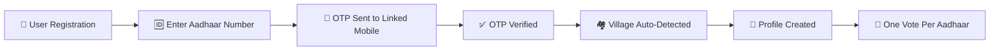

| Feature                     | Benefit                                       |
| --------------------------- | --------------------------------------------- |
| **One Account Per Aadhaar** | Eliminates fake/duplicate accounts            |
| **OTP Verification**        | Ensures only actual person can access         |
| **Village Auto-Detection**  | Aadhaar address links user to correct village |
| **Demographic Validation**  | Age, gender data for analytics                |
| **Masked Aadhaar Display**  | Privacy protection (XXXX-XXXX-1234)           |
| **eKYC Integration**        | Instant, paperless verification               |

**Security Measures:**

- ✅ UIDAI-compliant API integration
- ✅ End-to-end encryption of Aadhaar data
- ✅ No storage of full Aadhaar numbers (only Virtual ID)
- ✅ Consent-based data collection
- ✅ Audit logs for all authentication attempts

---

### 2. 🏘️ Mohalla/Division-Based Organization

- Village divided into distinct **Mohallas (divisions)**
- Issues tracked and managed at the division level
- Representatives can be assigned per division
- Aadhaar address used to auto-assign users to correct Mohalla

### 3. 📝 Community-Driven Complaint System

```
┌─────────────────────────────────────────────────────────────────┐
│  COMPLAINT LIFECYCLE                                            │
├─────────────────────────────────────────────────────────────────┤
│  📢 Raise    →   👍 Vote   →   📊 Threshold   →   🔔 Escalate |
│  Complaint       by Villagers    Reached           to Sarpanch  │
└─────────────────────────────────────────────────────────────────┘
```

- Individual villagers can raise complaints
- Complaints visible to all village members
- Community votes to prioritize issues
- Automatic escalation after reaching vote threshold
- Complete transparency in the resolution process

### 4. 👷 Contractor/Worker Management

- Sarpanch can assign contractors to approved complaints
- **Contractor Aadhaar Verification** - All workers must be verified
- Track worker details and assignments
- Monitor work progress with photo/video proof
- **GPS-Tagged Site Visits** - Verify actual presence at work site

### 5. 💰 Budget & Transparency Dashboard

- **Government Fund Tracking**: Monitor incoming budget allocations via PFMS integration
- **Expenditure Breakdown**: Detailed material and labor costs
- **Real-time Updates**: Live status of budget utilization
- **Complete Audit Trail**: Historical records for accountability
- **Community Sign-Off**: Villagers verify work completion before final payment

### 6. 📊 Progress Tracking

- Multi-stage complaint resolution tracking
- Status updates visible to all villagers
- Completion percentage and timeline visibility
- Mandatory photo/video evidence uploads
- **Community Verification** - 5+ Aadhaar-verified villagers must confirm work completion

---

## 👥 User Roles

### 1. 👨‍💼 Admin

| Permission        | Description                                  |
| ----------------- | -------------------------------------------- |
| System Management | Manage all users, villages, and divisions    |
| Oversight         | Monitor all activities across the platform   |
| Configuration     | Set voting thresholds and system parameters  |
| Reports           | Generate comprehensive reports and analytics |

### 2. 👨‍🌾 General User (Villagers)

| Permission        | Description                            |
| ----------------- | -------------------------------------- |
| Raise Complaints  | Submit issues related to their village |
| Vote              | Support/prioritize community issues    |
| Track Progress    | Monitor status of all complaints       |
| View Transparency | Access budget and contractor details   |

### 3. 🧑‍⚖️ Sarpanch

| Permission        | Description                               |
| ----------------- | ----------------------------------------- |
| Review Complaints | View escalated community issues           |
| Assign Work       | Add contractors and workers to complaints |
| Manage Budget     | Allocate and track government funds       |
| Update Progress   | Provide status updates on ongoing work    |
| Close Issues      | Mark complaints as resolved               |

---

## 📦 Issue Categories

The platform addresses the following key village development areas:

| Category                 | Icon | Description                                            |
| ------------------------ | ---- | ------------------------------------------------------ |
| **Water**                | 💧   | Water supply, quality, and irrigation issues           |
| **Environment**          | 🌳   | Environmental conservation, pollution, tree plantation |
| **Electricity**          | ⚡   | Power supply, outages, new connections                 |
| **Network + WIFI**       | 📶   | Mobile network, internet connectivity issues           |
| **Noise**                | 🔊   | Noise pollution and disturbance complaints             |
| **Education**            | 📚   | School facilities, teacher availability, resources     |
| **Hygiene & Sanitation** | 🧹   | Cleanliness, waste management, public toilets          |
| **Infrastructure**       | 🏗️   | Roads, buildings, public facilities                    |

---

## 🏗️ System Architecture

```
                              ┌─────────────────┐
                              │     ADMIN       │
                              │   Dashboard     │
                              └────────┬────────┘
                                       │
        ┌──────────────────────────────┼──────────────────────────────┐
        │                              │                              │
        ▼                              ▼                              ▼
┌───────────────┐           ┌─────────────────┐           ┌───────────────┐
│   VILLAGER    │           │    DATABASE     │           │   SARPANCH    │
│   Portal      │◄─────────►│                 │◄─────────►│   Dashboard   │
├───────────────┤           │  • Users        │           ├───────────────┤
│ • Raise Issue │           │  • Complaints   │           │ • View Issues │
│ • Vote        │           │  • Votes        │           │ • Assign Work │
│ • Track       │           │  • Contractors  │           │ • Track Budget│
│ • View Budget │           │  • Budgets      │           │ • Update      │
└───────────────┘           │  • Progress     │           └───────────────┘
                            └─────────────────┘
```

---

## 📊 Workflow Diagram

```mermaid
flowchart TB
     Villager["👨‍🌾 Villager Actions"]
        A[🏠 Login to Portal] --> B[📝 Raise Complaint]
        B --> C[📋 Select Category]
        C --> D[📍 Select Mohalla/Division]
        D --> E[✍️ Submit Details]
    end

     Community["🏘️ Community Engagement"]
        E --> F[👀 Complaint Visible to All Villagers]
        F --> G[👍 Villagers Vote on Complaint]
        G --> H{📊 Vote Threshold<br/>Reached?}
        H -->|No| G
        H -->|Yes| I[🔔 Auto-Escalate to Sarpanch]
    end

     Sarpanch["🧑‍⚖️ Sarpanch Actions"]
        I --> J[📨 Sarpanch Reviews Complaint]
        J --> K[👷 Assign Contractor/Worker]
        K --> L[💰 Allocate Budget]
        L --> M[📦 Add Materials Details]
        M --> N[🚀 Work Begins]
    end

     Progress["📈 Work Progress"]
        N --> O[📊 Update Progress Status]
        O --> P{✅ Work<br/>Completed?}
        P -->|No| O
        P -->|Yes| Q[✔️ Mark as Resolved]
        Q --> R[📢 Notify All Villagers]
    end

     Transparency["🔍 Transparency Dashboard"]
        L --> S[📊 Budget Dashboard Updated]
        K --> T[👷 Contractor Details Visible]
        M --> U[📦 Material Costs Logged]
        O --> V[📈 Progress Visible to All]
    end

    style Villager fill:#e8f5e9,stroke:#4caf50
    style Community fill:#e3f2fd,stroke:#2196f3
    style Sarpanch fill:#fff3e0,stroke:#ff9800
    style Progress fill:#f3e5f5,stroke:#9c27b0
    style Transparency fill:#fce4ec,stroke:#e91e63
```

---

## 🔄 Detailed Process Flow

### Complaint Resolution Flow

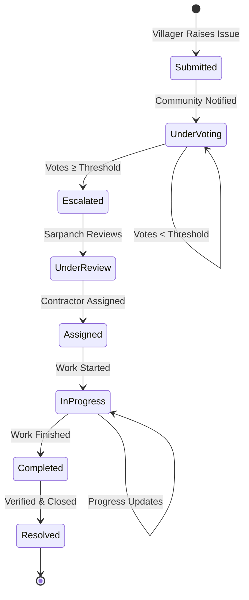

### Budget Allocation Flow

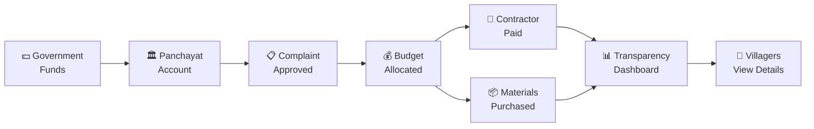

---

## 🔒 Challenges & Solutions

> [!NOTE]
> GRAM-SABHA addresses critical governance challenges through **Aadhaar-based strict authentication** and transparent processes.

| Challenge                 | Problem                              | Solution                                              |
| ------------------------- | ------------------------------------ | ----------------------------------------------------- |
| **Fake Accounts**         | Duplicate/bot accounts skew voting   | One account per Aadhaar number                        |
| **Vote Manipulation**     | Influential groups create fake votes | Aadhaar OTP verification for each vote                |
| **Identity Fraud**        | Impersonation of villagers           | eKYC verification with biometric option               |
| **Privacy Concerns**      | Personal data exposure               | Virtual ID (VID) instead of Aadhaar, masked display   |
| **Wrong Village Claims**  | Users join wrong village             | Auto-detection via Aadhaar address                    |
| **Contractor Fraud**      | Fake contractors, ghost workers      | All contractors must be Aadhaar-verified              |
| **Work Verification**     | "Completed" with no actual work      | GPS + Photo proof + Community sign-off                |
| **Budget Manipulation**   | Inflated costs, fake bills           | PFMS integration + Public ledger                      |
| **Digital Divide**        | Low smartphone access                | USSD/SMS fallback + Voice complaints                  |
| **Sarpanch Non-Adoption** | Refusal to use platform              | Government mandate + Performance tracking             |
| **Data Security**         | Data breaches                        | End-to-end encryption + UIDAI compliance              |
| **Retaliation Fear**      | Fear of complaint exposure           | Anonymous mode (Aadhaar verified but identity hidden) |

### Aadhaar Authentication Flow

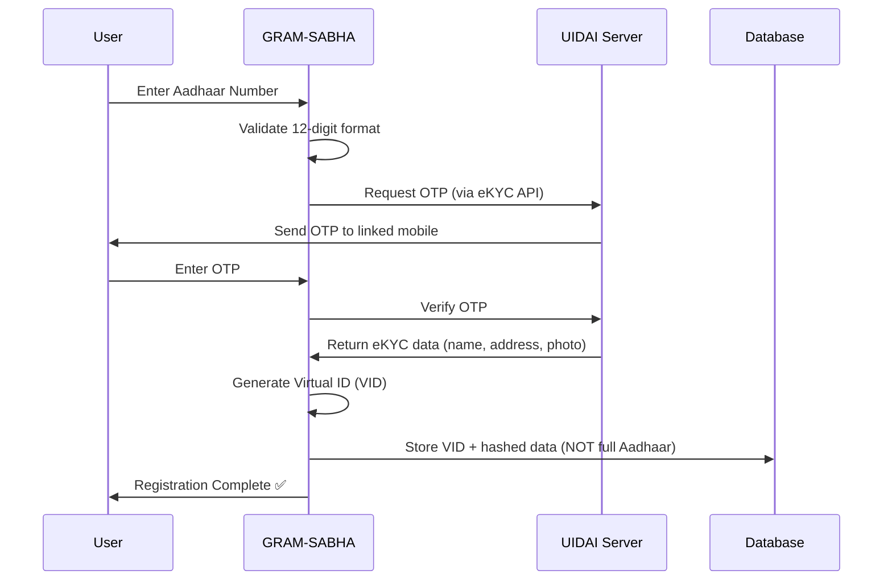

### Voting Security

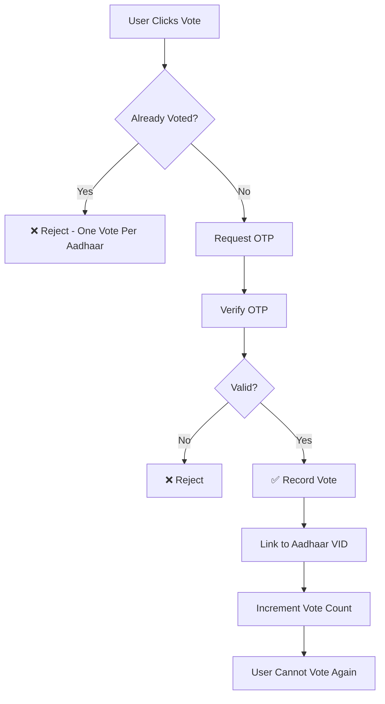

### Accessibility Solutions

| Barrier            | Solution                                              |
| ------------------ | ----------------------------------------------------- |
| No smartphone      | USSD code: `*123#` for basic access                   |
| No internet        | SMS-based complaint submission                        |
| Illiterate users   | Voice-based IVR + WhatsApp voice notes                |
| Elderly population | Assisted mode via village volunteers (Aadhaar-linked) |
| Language barriers  | Multi-language UI (Hindi, Regional)                   |
| Disabled users     | Screen reader compatible + Voice commands             |

---

## 🛡️ Complete Solutions Architecture

> [!IMPORTANT]
> This section provides **comprehensive solutions** to ALL identified challenges, making GRAM-SABHA a production-ready, scalable platform.

### 1. Multi-Modal Authentication System

**Problem:** UIDAI API access is restricted, OTP failures in low-network areas

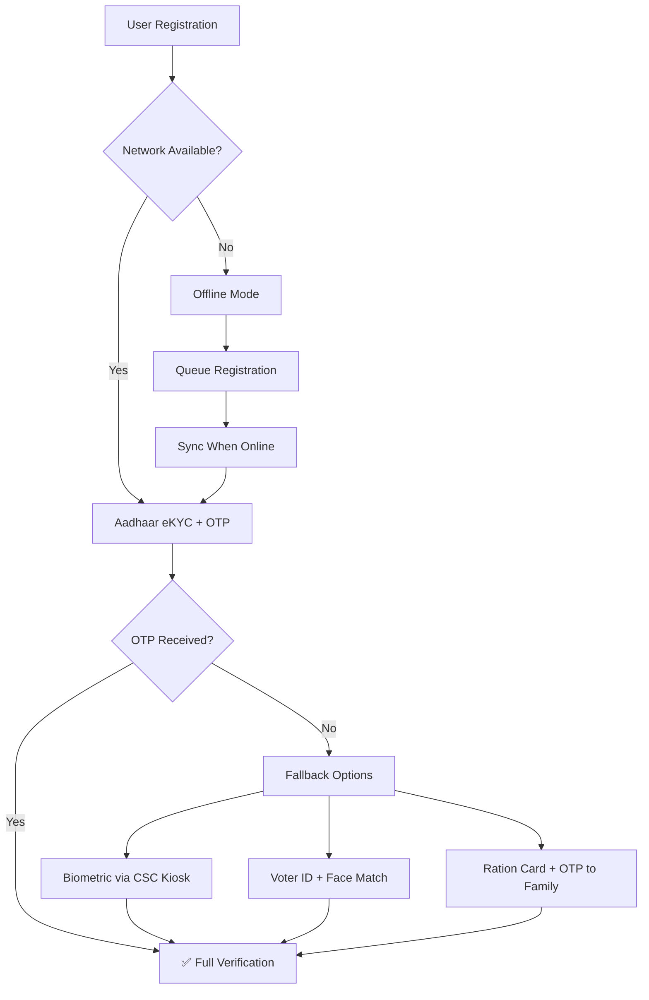

| Authentication Level      | Method                    | Use Case                |
| ------------------------- | ------------------------- | ----------------------- |
| **Level 1 (Primary)**     | Aadhaar eKYC + OTP        | Standard, full internet |
| **Level 2 (Fallback)**    | Aadhaar Biometric at CSC  | No mobile signal        |
| **Level 3 (Alternative)** | Voter ID + AI Face Match  | No Aadhaar              |
| **Level 4 (Minimal)**     | Ration Card + Family OTP  | Elderly/Children        |
| **Level 5 (Assisted)**    | CSC Operator Verification | Illiterate users        |

---

### 2. CSC Kiosk Model (Solves Digital Divide)

**Problem:** Many villagers don't have smartphones or internet access

**Solution:** Partner with **Common Services Centers (CSC)** - 400,000+ kiosks across India

```
┌─────────────────────────────────────────────────────────────────┐
│                    CSC KIOSK MODEL                              │
├─────────────────────────────────────────────────────────────────┤
│                                                                 │
│   👨‍🌾 Villager  ──►  🏪 CSC Kiosk  ──►  👤 VLE Operator         │
│                                                                 │
│   Services Available:                                           │
│   ✅ Raise complaints (operator types for illiterate users)    │
│   ✅ Biometric authentication (fingerprint/iris)               │
│   ✅ Vote on issues (with verified identity)                   │
│   ✅ View complaint status & budget reports                    │
│   ✅ Receive printed receipts for submissions                  │
│                                                                 │
│   VLE (Village Level Entrepreneur) Benefits:                   │
│   💰 ₹5-10 per transaction commission                          │
│   📊 Performance dashboard                                      │
│   🎓 Official training & certification                         │
│                                                                 │
└─────────────────────────────────────────────────────────────────┘
```

**Why This Works:**

- CSCs already exist in every Gram Panchayat
- VLEs are trusted community members
- Biometric devices already deployed
- No new infrastructure needed

---

### 3. Hybrid Connectivity Architecture

**Problem:** Poor network, power outages, app crashes

```mermaid
flowchart LR
     Online["🌐 Online Mode"]
        A[Full App Features]
        B[Real-time Sync]
        C[Live Voting]
    end

     Offline["📴 Offline Mode"]
        D[View Cached Complaints]
        E[Draft New Complaints]
        F[Queue Votes]
        G[View Saved Budget Data]
    end

     Fallback["📱 Fallback Channels"]
        H[USSD *123#]
        I[SMS 56789]
        J[IVR 1800-XXX-XXXX]
        K[WhatsApp Bot]
    end

    Online <-->|Auto Sync| Offline
    Fallback -->|Process & Store| Online
```

#### Multi-Channel Access

| Channel          | How It Works           | Features                                   |
| ---------------- | ---------------------- | ------------------------------------------ |
| **USSD `*123#`** | Dial from any phone    | Menu-based complaint, vote, status check   |
| **SMS to 56789** | Text command format    | `COMPLAINT WATER Handpump broken Ward 3`   |
| **IVR 1800-XXX** | Voice menu (toll-free) | Speak complaint in Hindi/Regional language |
| **WhatsApp Bot** | Chat + Voice notes     | Send text/audio/photo complaints           |
| **Missed Call**  | 1800-XXX-XXXX          | Receive callback with status update        |

#### Offline-First PWA

```javascript
// Service Worker Strategy
const OFFLINE_FEATURES = {
  complaints: "Cache First, Sync Later",
  votes: "Queue & Sync",
  budget_data: "Cached Daily",
  user_profile: "Stored Locally",
  maps: "Offline Tiles Downloaded",
};
```

---

### 4. Complete Work Verification System

**Problem:** Contractors can fake completion, inflate costs

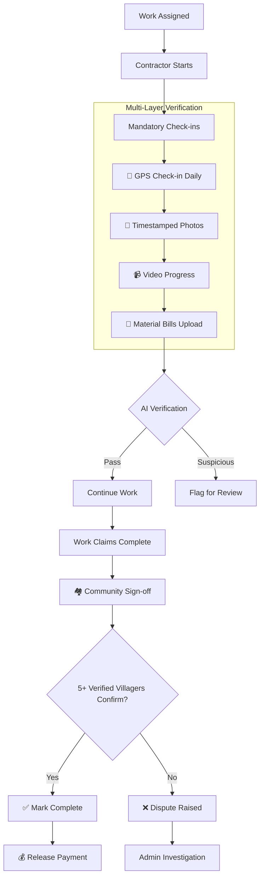

#### AI-Powered Fraud Detection

| Check                    | Method                 | Detection                            |
| ------------------------ | ---------------------- | ------------------------------------ |
| **Photo Authenticity**   | EXIF + AI Analysis     | Reused/stock photos flagged          |
| **GPS Verification**     | Geofencing             | Location must match worksite         |
| **Timeline Consistency** | Timestamp Analysis     | Can't upload past-dated photos       |
| **Cost Verification**    | Market Rate Comparison | Inflated costs flagged automatically |
| **Progress Matching**    | Before/After AI        | Actual work must be visible          |

#### Community Sign-Off Process

```
┌─────────────────────────────────────────────────────────────────┐
│                 WORK COMPLETION VERIFICATION                    │
├─────────────────────────────────────────────────────────────────┤
│                                                                 │
│  Contractor marks: "Work Complete"                              │
│           ▼                                                     │
│  Notification sent to 10 random Aadhaar-verified villagers     │
│           ▼                                                     │
│  Villagers visit site & verify (within 48 hours)               │
│           ▼                                                     │
│  Each villager submits: ✅ Verified / ❌ Not Done / ⚠️ Partial │
│           ▼                                                     │
│  If 5+ confirm ✅ → Payment Released                           │
│  If majority ❌ → Dispute Investigation                        │
│  If ⚠️ Partial → Partial Payment + Continue Work              │
│                                                                 │
└─────────────────────────────────────────────────────────────────┘
```

---

### 5. Anti-Corruption Transparency Layer

**Problem:** Budget manipulation, fake bills, contractor-politician nexus

```mermaid
flowchart TB
     FundFlow["💰 Fund Tracking"]
        A[PFMS Government Funds] --> B[Panchayat Bank Account]
        B --> C[GRAM-SABHA Records Transaction]
        C --> D[Public Ledger Updated]
    end

     Spending["📊 Expenditure Tracking"]
        E[Material Purchase] --> F[Bill Upload Required]
        F --> G[AI Rate Verification]
        G --> H[Public Price Display]

        I[Labor Payment] --> J[Worker Aadhaar Verified]
        J --> K[Attendance GPS Logged]
        K --> L[Public Wage Display]
    end

     Audit["🔍 Audit Trail"]
        D --> M[Immutable Log]
        H --> M
        L --> M
        M --> N[Any Villager Can View]
        M --> O[RTI-Ready Reports]
        M --> P[Government Audit Integration]
    end
```

#### Public Budget Dashboard Features

| Feature                    | How It Prevents Corruption           |
| -------------------------- | ------------------------------------ |
| **Live Fund Tracker**      | Shows exact amount received vs spent |
| **Bill Scanning**          | All receipts uploaded & OCR verified |
| **Market Rate Comparison** | Auto-flags costs >20% above market   |
| **Contractor History**     | Past performance visible to all      |
| **Payment Timeline**       | Shows when & how much paid to whom   |
| **Whistleblower Portal**   | Anonymous corruption reporting       |

---

### 6. Aadhaar Alternative Authentication

**Problem:** 5% population without Aadhaar, Aadhaar address outdated

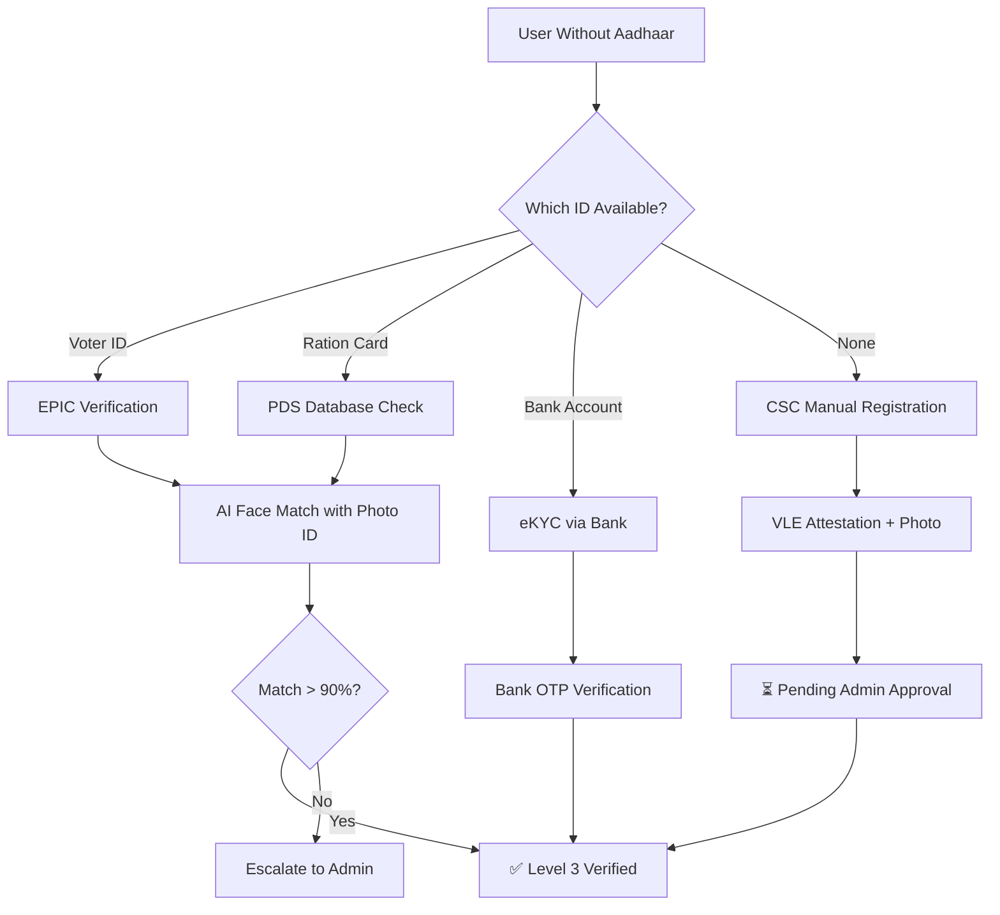

#### Village Assignment for Migrants

```
Problem: Aadhaar shows old village address
Solution: Multi-factor Village Verification
┌─────────────────────────────────────────────────────────────────┐
│ Step 1: Self-declare current village                            │
│ Step 2: Provide supporting proof:                               │
│         • Electricity bill with address                         │
│         • Bank statement with local branch                      │
│         • School admission letter for children                  │
│         • Any government letter to current address              │
│ Step 3: 2 existing verified villagers vouch for residency       │
│ Step 4: VLE/Sarpanch final approval                             │
└─────────────────────────────────────────────────────────────────┘
```

---

### 7. Privacy-First Architecture

**Problem:** Government surveillance, data misuse, fear of retaliation

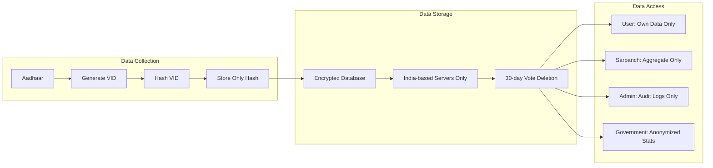

#### Anonymous Complaint Mode

| Feature                | Implementation                                                  |
| ---------------------- | --------------------------------------------------------------- |
| **Verified Anonymous** | Aadhaar verified at registration, identity hidden on complaints |
| **No Name Display**    | Shown as "Verified Villager #1234"                              |
| **No Location Leak**   | Mohalla shown, not exact location                               |
| **Encrypted Linking**  | Only court order can reveal identity                            |
| **Vote Privacy**       | Zero-knowledge proof - we know you voted, not what              |

---

### 8. Sarpanch Adoption Strategy

**Problem:** Sarpanch may refuse to use platform

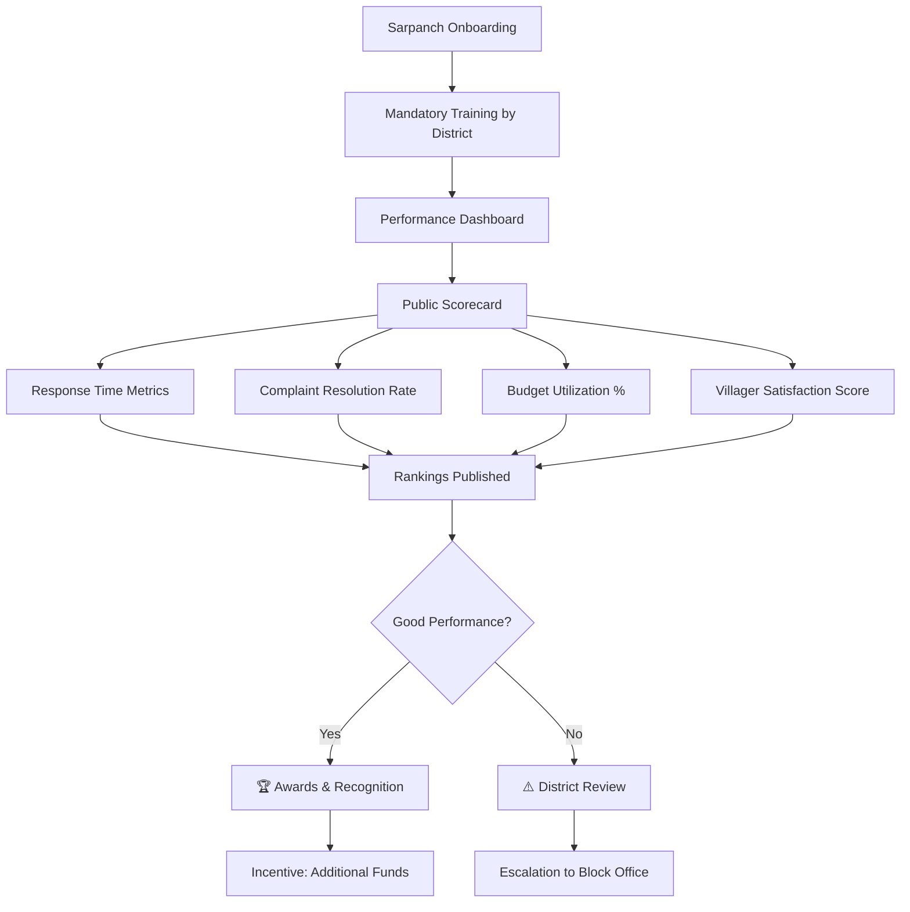

#### Incentives & Consequences

| For Good Performance       | For Poor Performance         |
| -------------------------- | ---------------------------- |
| 🏆 State-level recognition | ⚠️ Warning letter            |
| 💰 Bonus development funds | 📊 Public low ranking        |
| 📺 Media coverage          | 🔍 Audit by higher authority |
| 🎓 Training others         | ❌ Fund allocation delays    |

---

### 9. Complete Solution Summary

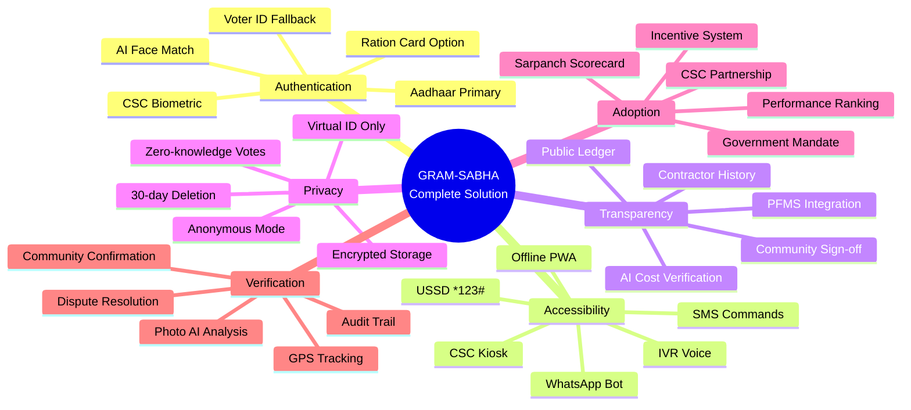

## 🔮 Future Scope

- [ ] **Mobile App** - Native Android/iOS applications
- [ ] **Multi-language Support** - Hindi, Regional Languages
- [ ] **AI-Powered Categorization** - Auto-categorize complaints
- [ ] **Blockchain Integration** - Immutable record keeping
- [ ] **Voice Complaints** - For users with limited literacy
- [ ] **Integration with Government Portals** - Direct fund tracking
- [ ] **Analytics Dashboard** - Predictive issue identification
- [ ] **Gamification** - Reward active community members

---

## 🚀 Deployment (Render backend + Netlify frontend)

This repository contains a static frontend (`frontend/`) and a Flask backend (`backend/`). The recommended split deployment is:

- Frontend: Netlify (static site) — publish `frontend/` directory
- Backend: Render (Web Service using the provided `Dockerfile`)

Quick steps

1. Create a GitHub repo and push this project.

2. Frontend → Netlify
  - In Netlify, create a new site from Git.
  - Connect your GitHub repo and select the branch (e.g., `main`).
  - Set the **Publish directory** to `frontend` (this repo includes `netlify.toml`).
  - Deploy. Netlify will serve the static HTML/CSS/JS.

3. Backend → Render (Docker)
  - Create a Render account and choose **New → Web Service**.
  - Connect your GitHub repo and pick the branch.
  - Choose **Docker** as the environment (Render will use the `Dockerfile` at repo root).
  - Set environment variables in the Render dashboard (see `backend/.env.example`) — at minimum:
    - `DATABASE_URL` (your Postgres/Neon URL)
    - `SECRET_KEY`
    - `CORS_ORIGINS` (add your Netlify site URL, e.g. `https://your-site.netlify.app`)
  - Set the service port to `5000` (the Dockerfile exposes 5000).
  - Deploy; Render will build the container and run `gunicorn backend.app:app`.

Environment & secrets

- Don't commit real secrets. Use Render's environment variables UI to set production values.
- Update `CORS_ORIGINS` to include your Netlify deploy URL.

Local testing (quick)

```powershell
python -m venv .venv
.\.venv\Scripts\Activate.ps1
pip install -r backend\requirements.txt
cd backend
python app.py
# Visit http://localhost:5000
```

Docker local test

```powershell
docker build -t innovit-app .
docker run -p 5000:5000 -e DATABASE_URL="your_local_db_url" -e SECRET_KEY="dev" innovit-app
# Visit http://localhost:5000
```

Need me to:

- Generate CI (GitHub Actions) to auto-deploy to Render/Netlify on push
- Create a `Procfile` and Render web-service instructions for non-Docker deployment
- Or deploy this for you if you give me Render/Netlify repo access (or walk you through connecting accounts)

